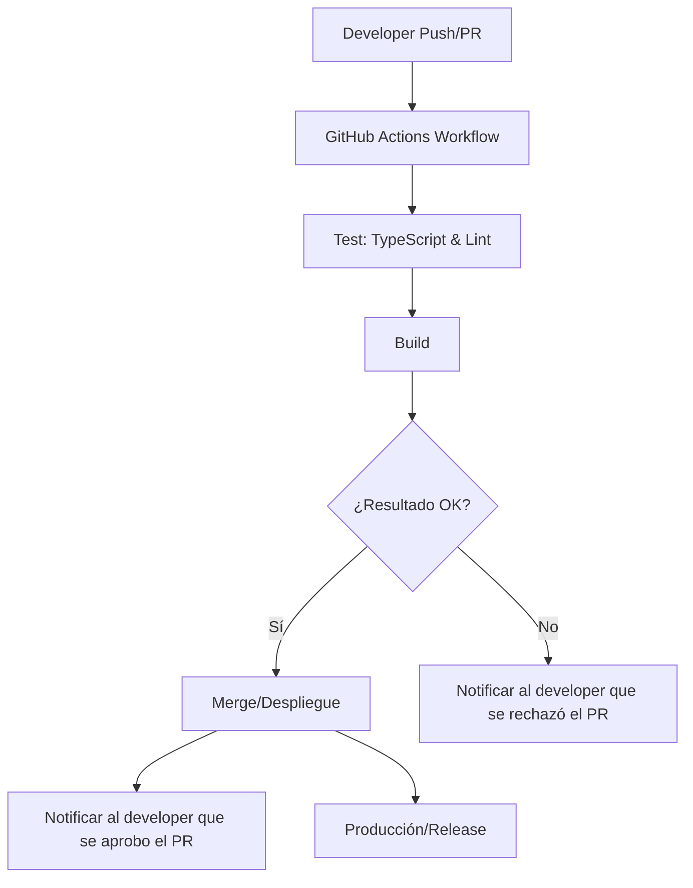
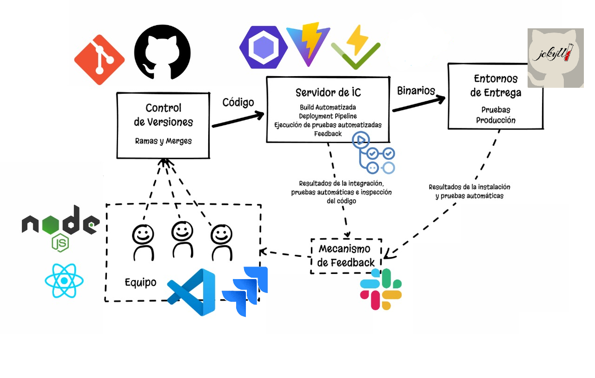

# Funcionamiento del sistema
1. Carga inicial de jugadores y categorías (simulada en data.ts). 
2. El usuario puede agregar jugadores y categorías desde la UI. 
3. Los ítems se pueden agregar a categorías (ej: armas, lugares, etc.). 
4. Se puede iniciar el juego si hay suficientes jugadores y categorías. 
5. Se reparte información “secreta” a los jugadores, que se muestra con alerts. 
6. Se puede ver el marcador o reiniciar la partida.
 
## ¿Cómo funciona?

1. Se cargan jugadores y categorías iniciales (desde `src/data.ts`).
2. Podés agregar más jugadores/categorías con los botones del menú.
3. Al iniciar el juego, se reparte información secreta y se muestra a cada jugador (simulado con alert).
4. Hay un marcador de ganadores (simulado).

[Cabe aclarar que los cambios como agregado de categorias/items/jugadores no tienen persistencia, solo se realizan dentro de la instancia. Cualquier refresh de la página resultará en un reinicio a los datos iniciales]

## ¿Cómo levantar el proyecto?

```sh
npm install
npm run dev
```

## ¿Cómo correr los tests?

```sh
npx vitest o npm test
```

## Estructura de carpetas

- `src/models`: modelos/clases de la app.
- `src/components`: componentes React.
- `src/data.ts`: datos iniciales.
- `tests/`: tests con Vitest.

---


## 1. Flujo de CI/CD



**Notas:**  
- Si el resultado es correcto (tests y build OK), se notifica al desarrollador.
- Si el resultado es incorrecto, se notifica tanto al desarrollador como a través de Slack.
- El proyecto tiene integracion entre Jira y Slack, con notificaciones por commits y PRs (aprobados y rechazados)

## Gráfico del esquema de integracion y entrega continua requerido



- Jekyll es un generador de sitios estaticos que se integra con Github Pages para crear y hostear sitios web directamente desde un repositorio de Github
- Jira es una herramienta de gestión de proyectos
- Slack es una aplicación de mensajeria
- Github Actions se encarga de las pruebas de entrega continua
- Vite y Vitest para el entorno del proyecto y el entorno de pruebas
- ESLint para las reviews del código y errores
- Node.js y React para la modularización de la app
- VS Code como interfaz de desarrollo
- Git como herramienta de control de versiones
- y por ultimo, Github como herramienta de gestión de repositorios


### comentarios extras
- Este proyecto lo comencé el año pasado y considero fue un buen desafio haberlo reestructurado y realizar la integración de las herramientas y configuraciones necesarias para la entrega solicitada por la cátedra
